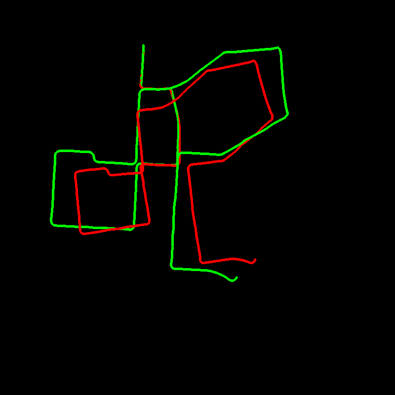
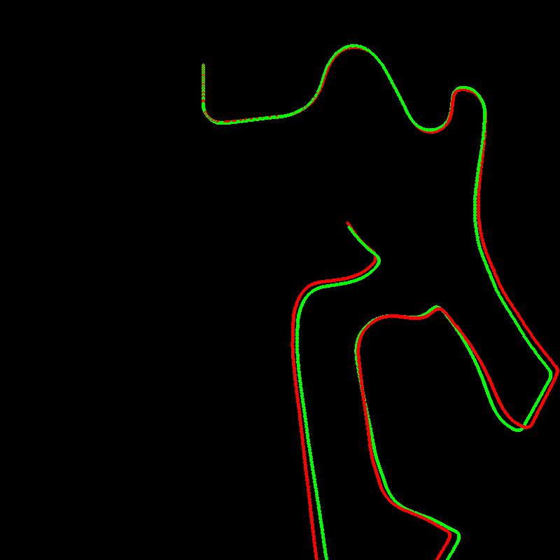
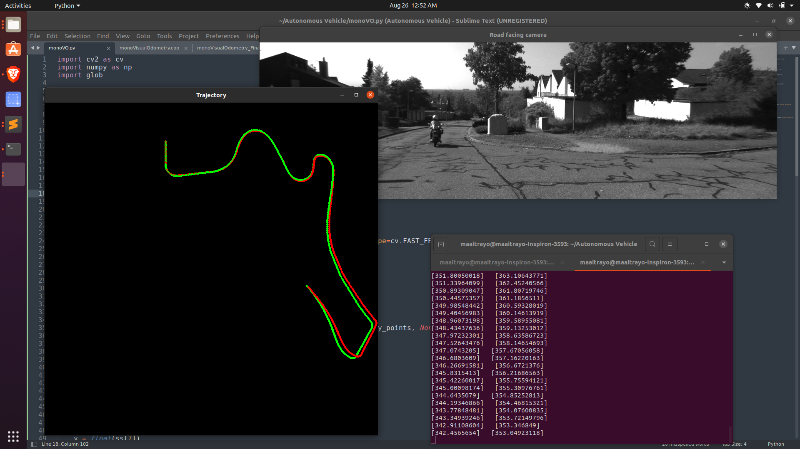

# TRAJECTORY OUTPUT
## Green line represent the KITTI ground truth poses
## Red line represent the calculated trajectory

## Trajectory on KITTI image dataset 1:

## Trajectory on KITTI image dataset 2:

## Working on ubuntu:

